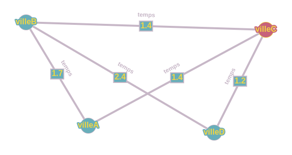
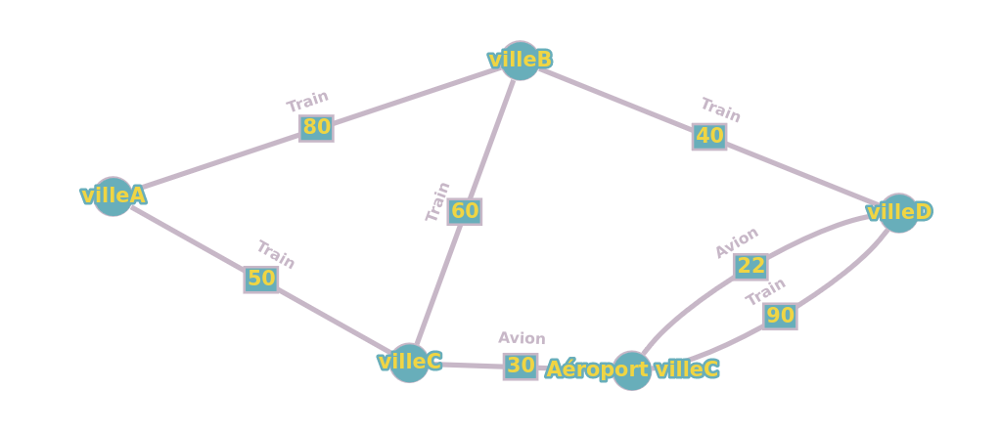

**Début du rapport**
------------------------------------------

SAE S2.02 -- Rapport pour la ressource Graphes
===

SERE Benjamin
LEGRAND Alexandre
POUPARD--RAMAUT Rémi

Version 1 : un seul moyen de transport
---

### Présentation d'un exemple

Pour illustrer le fonctionnement de notre système de recherche d'itinéraires, prenons l'exemple suivant :

**Données de la plateforme :**
- Lieux : villeA, villeB, villeC, villeD
- Tronçons :
  1. villeA -> villeB en train (CO2 = 60, Temps = 1.7, Prix = 80)
  2. villeB -> villeD en train (CO2 = 22, Temps = 2.4, Prix = 40)
  3. villeA -> villeC en train (CO2 = 42, Temps = 1.4, Prix = 50)
  4. villeB -> villeC en train (CO2 = 14, Temps = 1.4, Prix = 60)
  5. villeC -> villeD en avion (CO2 = 110, Temps = 150, Prix = 22)
  6. villeC -> villeD en train (CO2 = 65, Temps = 1.2, Prix = 90)

**Préférences de l'utilisateur :**
- Moyen de transport choisi : Train
- Critère d'optimisation : Temps
- Nombre d'itinéraires demandés : 2

**Solution du problème :**
L'utilisateur souhaite trouver les deux meilleurs itinéraires en train, optimisés selon le temps.

Les itinéraires possibles sont les suivants :
1. villeA -> villeC -> villeD (Temps = 1.4 + 1.2 = 2.6)
2. villeA -> villeB -> villeD (Temps = 1.7 + 2.4 = 4.1)

Les meilleurs itinéraires sont donc :
1. villeA -> villeC -> villeD, car ils offrent le temps de trajet le plus court.
2. villeA -> villeB -> villeD, en deuxième position en termes de temps.

### Modèle pour l'exemple

Le graphe modélisant cet exemple contient des sommets représentant les lieux (villeA, villeB, villeC, villeD) et des arêtes représentant les tronçons entre ces lieux. Les poids des arêtes sont déterminés par le temps de trajet en train entre chaque paire de lieux.

### Modélisation pour la Version 1 dans le cas général

Dans le cas général, étant donné un problème de recherche d'itinéraire, nous construisons un graphe orienté où chaque sommet représente un lieu et chaque arête représente un tronçon entre deux lieux. Les poids des arêtes sont déterminés en fonction du critère d'optimisation choisi (CO2, Temps, ou Prix). Le graphe est construit en fonction du moyen de transport choisi, ici le train. Pour résoudre le problème d'itinerair, le programme utilise l'algorithme des K plus courts chemins (kpcc) pour trouver les chemins les plus courts dans ce graphe.

### Implémentation de la Version 1

Le nom complet de la classe de test pour la Version 1 est `TestPlateforme.java`. La date et l'identifiant du commit à regarder sont [May 19, 2024 at 5:09:17 PM GMT+2 / ee977bcf6f580edf5347ed5310e635821e02d6bb]. Vous pouvez consulter le code de cette classe sur GitLab via ce [lien vers la page de cette classe sur GitLab](https://gitlab.univ-lille.fr/sae2.01-2.02/2024/F5/-/blob/main/test/app/TestPlateforme.java?ref_type=heads).

Version 2 : multimodalité et prise en compte des correspondances
---

### Présentation d'un exemple

Soit une personne qui souhaite aller de la villeA à la villeD le plus vite possible :

**Données de la plateforme :**
- Lieux : villeA; villeB; villeC; villeC, Avion ; villeD
- Tronçons :
  1. villeA -> villeB en train (Prix = 60, CO2 = 1.7, Temps = 80)
  2. villeB -> villeD en train (Prix = 22, CO2 = 2.4, Temps = 40)
  3. villeA -> villeC en train (Prix = 42, CO2 = 1.4, Temps = 50)
  4. villeB -> villeC en train (Prix = 14, CO2 = 1.4, Temps = 60)
  5. villeC -> villeD en avion (Prix = 110, CO2 = 150, Temps = 22)
  6. villeC -> villeD en train (Prix = 65, CO2 = 1.2, Temps = 90)
  7. villeC -> villeC, Avion en Avion (Prix = 50, CO2 = 8, Temps = 30);

**Préférences de l'utilisateur :**
- Critère d'optimisation : Temps
- Nombre d'itinéraires demandés : 1

**Solution du problème :**
L'utilisateur souhaite trouver le meilleur itinéraire optimisé selon le temps.

Le meilleur itinéraire est donc :
1. villeA -> villeC -> Aéroport Ville C -> villeD, car il offre le temps de trajet le plus court.

### Modèle pour l'exemple

Le graphe modélisant cet exemple contient des sommets représentant les lieux (villeA; villeB; villeC; villeC, Avion; villeD) et des arêtes représentant les tronçons entre ces lieux. Les poids des arêtes sont déterminés par le temps de trajet entre chaque paire de lieux.

### Modélisation pour la Version 2 dans le cas général

Nous créeons un graphe orienté où chaque sommet représente un lieu et chaque arête représente un tronçon entre deux lieux. Les poids des arêtes sont déterminés en fonction du critère d'optimisation choisi (CO2, Temps, ou Prix). Nous gardons cette fois-ci les tronçons avec des modalités différentes. Pour les correspondances, nous ajoutons au graphe un sommet représentant le départ pour le changement de correspondance, par exemple pour la villeC nous créeons un autre sommet villeC, Avion. Le tronçon villeC - villeC, Avion aura alors le poids présent dans le fichier correspondance. Par la suite, nous calculons les plus courts chemins entre la ville de départ et d'arrivé.
 
### Implémentation de la Version 2

Le nom complet de la classe de test pour la Version 2 est `TestPlateforme.java`. La date et l'identifiant du commit à regarder sont [June 7, 2024 at 2:05:17 PM GMT+2 /  1bd023ee3d47836e509828f702aea608fb49ed9b]. Vous pouvez consulter le code de cette classe sur GitLab via ce [lien vers la page de cette classe sur GitLab](https://gitlab.univ-lille.fr/sae2.01-2.02/2024/F5/-/blob/1bd023ee3d47836e509828f702aea608fb49ed9b/test/app/TestPlateforme.java).

Version 3 : optimisation multi-critères
---

### Présentation d'un exemple

Soit une personne qui souhaite aller de la villeA à la villeD le plus vite possible :

**Données de la plateforme :**
- Lieux : villeA; villeB; villeC; villeC, Avion ; villeD
- Tronçons :
  1. villeA -> villeB en train (Prix = 60, CO2 = 1.7, Temps = 80)
  2. villeB -> villeD en train (Prix = 22, CO2 = 2.4, Temps = 40)
  3. villeA -> villeC en train (Prix = 42, CO2 = 1.4, Temps = 50)
  4. villeB -> villeC en train (Prix = 14, CO2 = 1.4, Temps = 60)
  5. villeC -> villeD en avion (Prix = 110, CO2 = 150, Temps = 22)
  6. villeC -> villeD en train (Prix = 65, CO2 = 1.2, Temps = 90)
  7. villeC -> villeC, Avion en Avion (Prix = 50, CO2 = 8, Temps = 30);

**Préférences de l'utilisateur :**
- Critère d'optimisation : 
  - Train
  - Bus
  - CO2 à 100% 
  - Temps à 50% 
  - Prix à 0%

**Solution du problème :**
L'utilisateur souhaite trouver le meilleur itinéraire selon le CO2, le temps et uniquement en train ou/et bus.

Le meilleur itinéraire est donc :
1. villeA --TRAIN--> villeD, car il offre le trajet le moins polluant mais qui prend aussi en compte le temps, uniquement en avion ou en bus.

### Modèle pour l'exemple

Le graphe modélisant cet exemple contient des sommets représentant les lieux (villeA; villeB; villeC; villeC, Avion; villeD) et des arêtes représentant les tronçons entre ces lieux. Les poids des arêtes sont déterminés par le temps de trajet entre chaque paire de lieux.

### Modélisation pour la Version 3 dans le cas général

Nous créeons 3 graphes avec le même squelette, seul le poids des tronçons change d'un graphe à l'autre pour s'adapter aux critères de tri séléctionnés. Ensuite, nous allons faire plusieurs boucles sur les tronçons des 3 graphes. Une fois que nous avons les 3 tronçons qui sont identiques, nous ajoutons ce tronçon à un nouveau graphe coefficienté. Pour calculer le poids de ce tronçon nous multiplions le poids du tronçon selon le critère de tri en question et le coefficient séléctionné dans l'interface. Nous faisons cela pour tous les tronçons afin de contituer ce 4eme graphe qui sera le graphe sur lequel nous ferons nos KPCC. Enfin, nous trions ces tronçons par les modalités de transport choisis par l'utilisateur. 
 
### Implémentation de la Version 3

Le nom complet de la classe de test pour la Version 3 est `TestPlateforme.java`. La date et l'identifiant du commit à regarder sont [June 14, 2024 at 5:23:09 PM GMT+2 / 7608721f47c02b8345465030932bddc64205b94a]. Vous pouvez consulter le code de cette classe sur GitLab via ce [lien vers la page de cette classe sur GitLab](https://gitlab.univ-lille.fr/sae2.01-2.02/2024/F5/-/blob/7608721f47c02b8345465030932bddc64205b94a/test/app/TestPlateforme.java).

----------------------------------------------------

**Fin du rapport**

### Barème sur 30 pts

Toute question sur le barème est à adresser à iovka.boneva@univ-lille.fr

- Rapport non rendu à temps -> note 0 
- **(7, décomposé comme suit)** Divers
  - **(1,5)** Respect de la structure du rapport
  - **(1,5)** Section Version 1 rendue pour le 18/05/2024. Cette version peut contenir les parties en italique.
  - **(1,5)** Section Version 2 rendue pour le 08/06/2024. Cette version peut contenir les parties en italique.
  - **(1)** Utilisation de vocabulaire précis sur les graphes (termes vu en cours, noms des algorithmes, etc.)
  - **(1,5)** Style d'écriture fluide et compréhensible

- **(8, décomposé comme suit)** Solution pour la Version 1
  - **(2)** Exemple pertinent (illustre tous les aspects du problème) et lisible (en particulier, ni trop grand ni trop petit, bien présenté)
  - **(4)** Le modèle de l'exemple permet de trouver la solution sur l'exemple. La modélisation pour le cas général permet de résoudre le problème posé
  - **(2)** L'implémentation de l'exemple est correcte et fonctionnelle

- **(6, décomposé comme suit)** Solution pour la Version 2
  - **(1)** Exemple pertinent
  - **(4)** le modèle de l'exemple permet de trouver la solution sur l'exemple. La modélisation pour le cas général permet de résoudre le problème posé
  - **(1)** L'implémentation de l'exemple est correcte et fonctionnelle

- **(3)** Qualité de la description de la solution (concerne les sections "Modèlisation dans le cas général" pour les Versions 1 et 2):
  - La modélisation pour le cas général est décrite de manière abstraite mais précise et complète. Pour vous donner une idée, un·e étudiant·e de BUT qui a validé les ressources Graphes et Dev devrait être en mesure d'implémenter votre solution d'après la description que vous en faites, sans avoir à trop réfléchir.

- **(6)** Solution pour la Version 3: mêmes critères que pour la Version 2