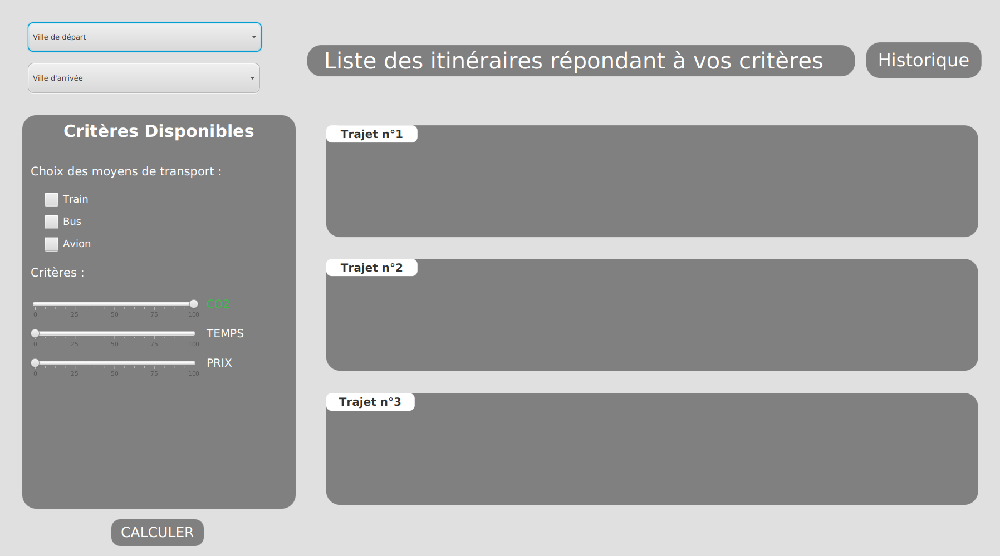

**Début du rapport**
------------------------------------------

SAE S2.02 -- Rapport IHM
===

Groupe F5: 

SERE Benjamin  
LEGRAND Alexandre  
POUPARD--RAMAUT Rémi  
---

### Lien vers le Gitlab

[cliquer ici](https://gitlab.univ-lille.fr/sae2.01-2.02/2024/F5)

Référence du commit : //A METTRE APRES

### Résultat Final

### Justification des critères ergonomiques 

Pour justifier nos choix de conception d'interface en fonction des critères ergonomiques et des guides de conception, nous avons intégré plusieurs principes clés afin d'assurer l'efficacité, l'intuitivité et la satisfaction des utilisateurs :  
  - Choix des couleurs : Le choix de mettre le label "CO2" en vert pour symboliser l'impact environnemental est fondé sur l'intuition des utilisateurs. Le vert étant associé à l'écologie et à la durabilité, cette décision respecte les conventions visuelles courantes, facilitant ainsi la compréhension immédiate de son rôle.

  - Paramétrage par défaut : Le réglage par défaut du curseur "CO2" au maximum reflète une orientation proactive vers des solutions de transport plus écologiques. Cette décision répond à une demande croissante des utilisateurs pour des options durables, simplifiant ainsi la sélection pour ceux qui privilégient les critères environnementaux et réduisant la charge cognitive.

  - Ergonomie et disposition : L'ergonomie de l'interface est optimisée par une disposition logique et intuitive. Les champs de saisie pour les villes de départ et d'arrivée sont positionnés en haut, suivis des critères de sélection à gauche, ce qui correspond aux habitudes naturelles de lecture et d'interaction. Cette disposition maximise la visibilité et s'aligne avec les attentes des utilisateurs, conforme aux critères ergonomiques de Scapin.

  - Guidance et contrôle explicite : Les étiquettes claires et les curseurs bien définis permettent aux utilisateurs de voir et d'ajuster facilement leurs choix. Cette approche garantit un contrôle explicite et une guidance efficace, éléments essentiels pour une expérience utilisateur fluide et sans ambiguïté.

  - Minimisation de la charge de travail : En regroupant de manière cohérente les options de transport et les critères de sélection avec des étiquettes bien définies, nous réduisons le nombre de clics nécessaires pour configurer une recherche. Cette simplification de l'interface diminue la charge cognitive des utilisateurs, améliorant ainsi leur efficacité et leur satisfaction lors de l'utilisation.

  - Théorie de la Gestalt : Les principes de proximité et de similarité ont été appliqués pour regrouper les options de transport et les critères de sélection. Une disposition linéaire guide naturellement l'œil de l'utilisateur de haut en bas, assurant une continuité visuelle. Les contrastes de couleurs appropriés garantissent que les éléments interactifs sont clairement distingués du fond, facilitant ainsi la navigation et l'interaction utilisateur.   

### Plan de répartition des tâches pour la conception de l'interface

Tableau des étapes de conception attribuées à chaque membre de l'équipe :

| Tâche                    | Benjamin | Alexandre | Rémi |
| ------------------------ | -------- | --------- | ---- |
| Brainstorming            |  ✓        |  ✓         |  ✓    |
| Interface Basse Fidélité |  ✓        |  ✓         |  ✓    |
| Interface Haute Fidélité |  ✓        | X         | X    |
| Implémentation           | X        |  ✓         | X    |
| Débugage                 |  ✓        |  ✓         | X    |
| Vidéo Interface Rapport  |  ✓        | X         | X    |
| Compte Rendu             | X        | X         |  ✓    |

### Autres informations 

#### Innovation et Points Forts de l'Application

Notre application se distingue par plusieurs innovations clés qui améliorent significativement l'expérience utilisateur. Parmi celles-ci, nous avons intégré un système de recommandation personnalisée basé sur l'écologiques , ce qui permet une sélection rapide et intuitive des options de transport les plus durables. De plus, l'interface offre une navigation fluide et une visibilité optimale grâce à une disposition ergonomique conforme aux meilleures pratiques de conception.

#### Adaptabilité et Extensibilité

Conscients de l'évolution constante des besoins des utilisateurs, nous avons conçu notre application pour être hautement adaptable et extensible. En utilisant JavaFX 17.0.2 et en structurant notre code de manière à faciliter l'ajout de nouvelles fonctionnalités, nous avons non seulement assuré la compatibilité avec les dernières technologies, mais nous avons également planifié l'intégration de nouveaux critères de tri et de moyens de transport supplémentaires pour l'avenir.

