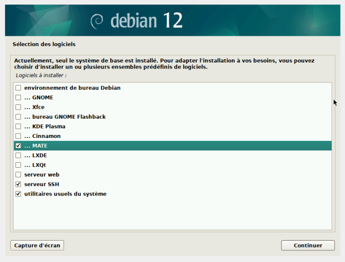
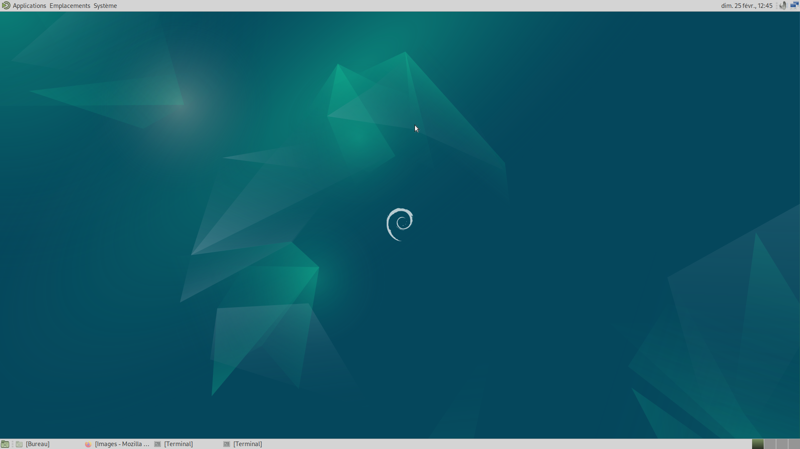

# Installation d'une Machine Virtuelle


## Introduction

La création et l'installation d'une machine virtuelle (VM) permettent d'exécuter un système d'exploitation supplémentaire sur une machine hôte. Ce rapport détaille le processus d'installation d'une machine virtuelle à l'aide de VirtualBox avant de parler du processus d'auto-installation.

### Prérequis

Avant de commencer, assurez-vous que votre système dispose des éléments suivants :

- **Image ISO du système d'exploitation :** Obtenez l'image ISO du système d'exploitation que vous souhaitez installer sur la machine virtuelle.

## Étapes d'installation

### Création d'une Machine Virtuelle

1. Lancez VirtualBox après l'installation.

2. Cliquez sur "Nouvelle" pour créer une nouvelle machine virtuelle.

3. Suivez l'assistant de création de machine virtuelle en fournissant un nom, un type et une version de système d'exploitation.

    * Allouez 2 Go de RAM pour la machine virtuelle.

    * Créez un disque dur virtuel et allouez 20 Go d'espace de stockage.


### Configuration de l'Image ISO

1. Dans les paramètres de la machine virtuelle, accédez à la section "Stockage".

2. Sous le contrôleur IDE, ajoutez un périphérique de stockage optique.

3. Sélectionnez l'image ISO du système d'exploitation que vous avez téléchargée, ici nous avons télécharger une image ISO de Debian 12 disponible sur le site [Debian{ width=23px }](https://www.debian.org/).

### Installation du Système d'Exploitation

1. Démarrez la machine virtuelle.

2. Suivez les instructions du programme d'installation du système d'exploitation.

{ width=40% }

3. Sélectionnez le disque virtuel que vous avez créé comme emplacement d'installation.

4. Complétez le processus d'installation en suivant les étapes fournies par le système d'exploitation.

### Conclusion

La machine virtuelle a enfin été installée, maintenant nous allons l'installer de façon automatique, c'est-à dire en automatisant nos réponses.

# Installation d'une machine virtuelle automatisée


## Introduction

Maintenant nous allons passer à l'installation automatisée d'une machine virtuelle, grâce au script `AUTOINSTALL_DEBIAN.zip` fourni.

## Étapes d'installation

### Préparation

1. Premièrement il a fallu aller chercher le script d'installation automatisée sur Moodle.

2. Puis il faut insérer le script dans l'espace du disque optique.

3. Maintenant il suffit de lancer la machine virtuelle jusqu'au démarrage de la machine.

4. Une fois démarré, nous arrivons sur un terminal car aucune interface graphique n'a été installée.

5. Pour installer une interface graphique grâce au script, nous avons rajouté `mate-desktop` à la suite de la commande `tasksel` dans le `preseed.cfg` :

`tasksel tasksel/first multiselect standard ssh-server, mate-desktop`

{ width=50% }

6. Ensuite on peut relancer la machine et l'installation de base est terminée.

### Différents ajouts demandés

Nous avons dû ajouter les droits **sudo** à l'utilisateur *user*, pour cela nous avons ajouté dans le fichier `vboxpostinstall.sh` la commande suivante :

`log_command_in_target usermod -aG sudo "user"`

Bien évidemment, nous avons dû automatiser l'installation des différents paquets dans le `preseed-fr.cfg`:

`d-i pkgsel/include string sqlite3 sudo curl bash-completion git neofetch`


# Configuration de git

## Introduction

Nous allons nous intéresser au paquet git installé au-dessus, ici nous allons configurer un dépôt distant git ainsi qu'un dépôt local.

### Configuration du profil

Pour cela, nous allons d'abord configurer notre profil git avec les commandes suivantes :
```bash
git config --global user.name "votreprenom votrenom"

git config --global user.email "votre@e.mail"

git config --global init.defaultBranch "master"
```
Les 2 premières commandes servent à identifier la personne, la machine qui fait les ajouts sur le dépôt git.

Quant à la dernière ligne, celle-ci permet à chaque initialisation de dépôt git le nom de celui-ci par le mot entre guillemet, ici master.

### Installation d'autres paquets

Nous devons installer les paquets suivants :

|Paquets|Commande|Explication|
|----|----|----|
|gitk|`sudo apt-get install gitk`|**Gitk** est une interface graphique pour Git qui permet de visualiser l'historique des commits, les branches et les différences entre les versions dans un environnement graphique|
||||
|git-gui|`sudo apt-get install git-gui`|**git-gui** est aussi une interface graphique pour Git qui permet de visualiser les commits ou d'initialiser un dépôt. Nous pouvons le lancer sans dépôt existant via la commande `git-gui &` pour le lancer en tâche de fond|

### Installation d'une interface graphique Git de notre choix

Nous avons choisi d'installer `Sublime Merge`, afin de l'installer nous avons suivi les étapes d'installation présentes [sur leur page](https://www.sublimemerge.com/docs/linux_repositories)

```bash
-wget -qO - https://download.sublimetext.com/sublimehq-pub.gpg | gpg --dearmor |  
sudo tee /etc/apt/trusted.gpg.d/sublimehq-archive.gpg > /dev/null

-sudo apt-get install apt-transport-https

-echo "deb https://download.sublimetext.com/ apt/stable/" |  
sudo tee /etc/apt/sources.list.d/sublime-text.list

-sudo apt-get update

-sudo apt-get install sublime-merge
```
# Gitea

Nous allons maintenant aborder l'installation de [`Gitea`](https://gitea.com).

## Installation

### Télécharger le paquet

Pour commencer nous allons télécharger le paquet avec la commande suivante :

-`wget -O gitea https://dl.gitea.com/gitea/1.21.7/gitea-1.21.7-linux-amd64`

Puis donner le droit d'exécution :

-`chmod +x gitea`

### Préparation de l'environnement

**Avant tout, si vous avez mal installé Git, cela pourrait créer des problèmes**[^1]


### Création de l'utilisateur système  

Pour les distributions Debian depuis l'utilisateur **root**, il faudra créer un nouvel utilisateur système avec la commmande :

`-adduser --system --shell /bin/bash --gecos 'Git Version Control' --group --disabled-password --home /home/git git`

### Répertoires nécessaires  

Puis il faut créer les différents répertoires nécessaires :
```bash
mkdir -p /var/lib/gitea/{custom,data,log}
chown -R git:git /var/lib/gitea/
chmod -R 750 /var/lib/gitea/
mkdir /etc/gitea
chown root:git /etc/gitea
chmod 770 /etc/gitea
```
### Configuration du répertoire de travail  

Maintenant il faut définir le répertoire dans lequel Gitea va travailler :

-`export GITEA_WORK_DIR=/var/lib/gitea/`

### Déplacer le fichier binaire au bon endroit  

-`cp gitea /usr/local/bin/gitea`

### Auto-complétion bash/zsh  

Pour l'auto-complétion `bash`, un script est présent sur [cette page](https://raw.githubusercontent.com/go-gitea/gitea/main/contrib/autocompletion/bash_autocomplete) qui pourra être copié dans un fichier dont le chemin est : `/usr/share/bash-completion/completions/gitea`

Pour l'auto-complétion `zsh`, un autre script est présent sur [cette page](https://raw.githubusercontent.com/go-gitea/gitea/main/contrib/autocompletion/zsh_autocomplete) qui pourra être copier dans un fichier dont le chemin est : `/usr/share/zsh/_gitea` 

## Démarrer Gitea

Nous créeons un service Linux afin de démarrer Gitea automatiquement :

-`sudo systemctl enable gitea --now`

Pour démarrer Gitea avec une ligne de commande, nous pouvons inscrire celle-ci dans le terminal MATE : 

-`GITEA_WORK_DIR=/var/lib/gitea/ /usr/local/bin/gitea web -c /etc/gitea/app.ini`

## Plus d'informations

Pour plus de renseignements, la page de la documentation complète en anglais de Gitea est consultable juste ici : [Doc Gitea](https://docs.gitea.com/)

[^1]: Vous pouvez par exemple utiliser la commande git --version