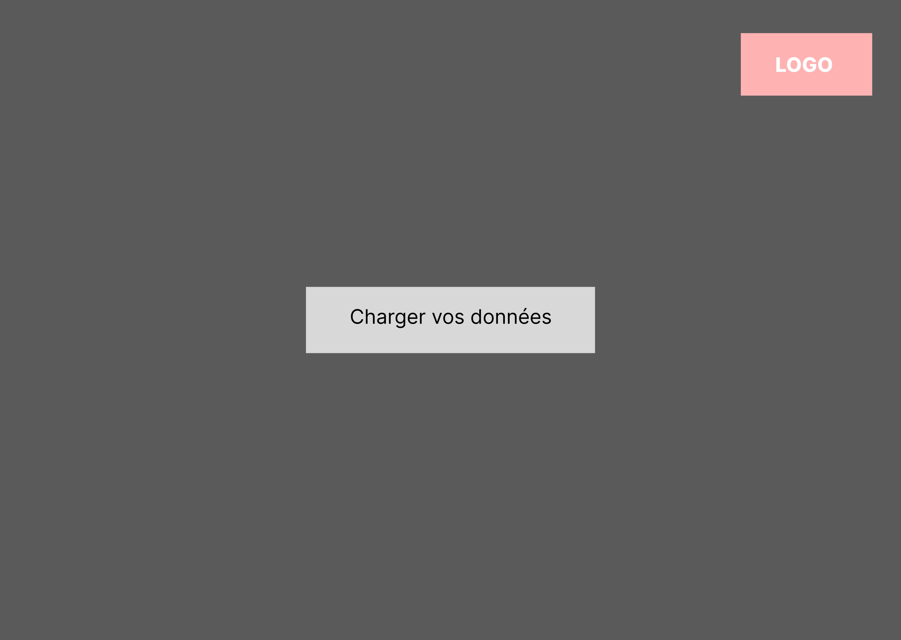
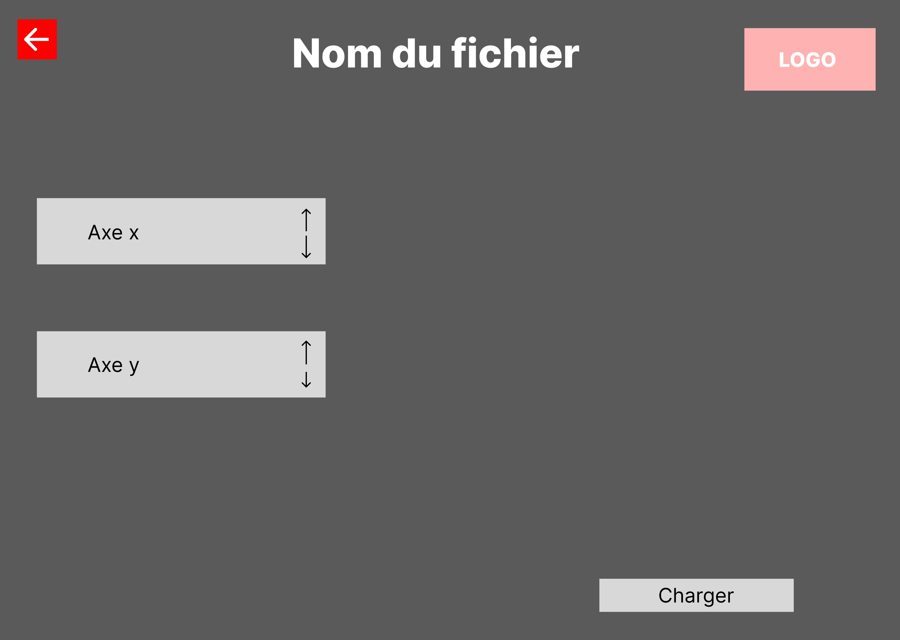
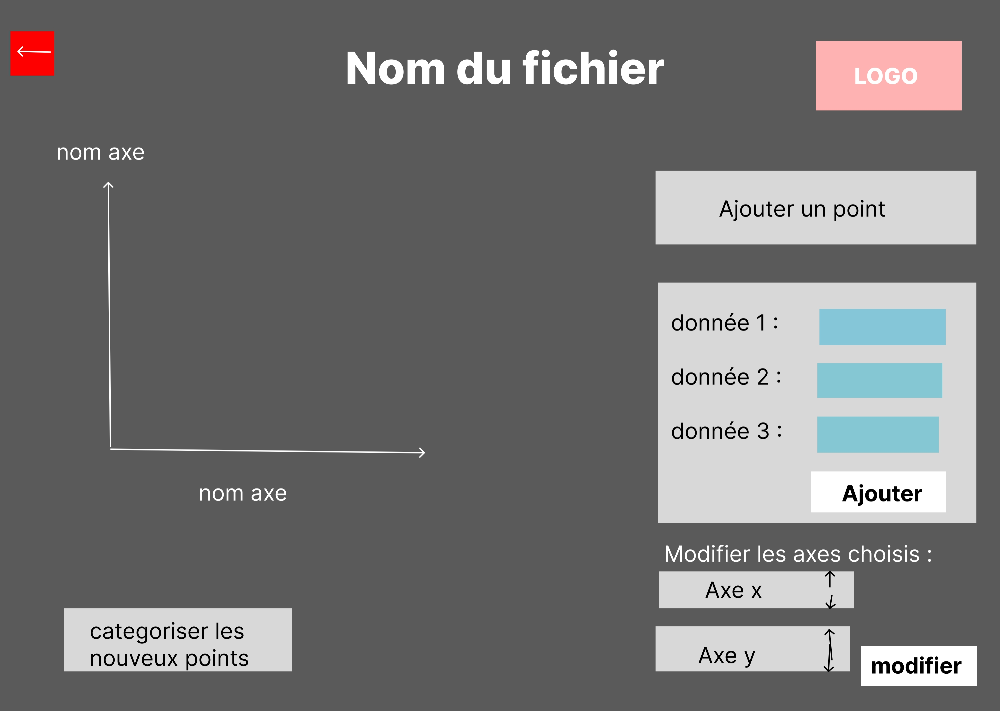
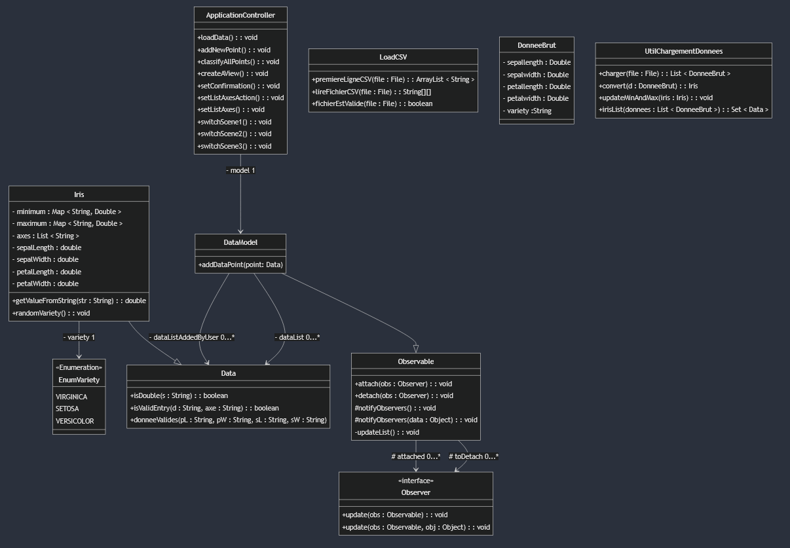

# Classification

## Équipe 
G2

- Alexandre Legrand 
- Aymane Benafquir 
- Louis Beck 
- Kylian Robin

## Organisation du travail

- Alexandre Legrand :

    - Projet dans son ensemble : \
        Pour ce jalon 1, je me suis occupé avec mon groupe de l'imagination de nos classes et des méthodes nécessaires. Plus personnellement, je me suis occupé de la majorité des FXML et de leur fonctionnement (lien entre les méthodes et les champs/boutons). De plus j'ai utilisé le code fourni par mes camarades afin qu'il respecte le pattern MVC. Enfin, j'ai pu m'occuper de l'ajout des points par l'utilisateur ainsi que la classification de tous les points, du file explorer, des méthodes pour changer de scène et de l'exécution de JavaFX (classe Main);

    - Dossier d'analyse :\
        Pour le dossier d'analyse, j'ai notamment m'occuper de la conception de 2 fiches descriptives, de plus je me suis occupé de la description des images du prototype et d'une partie du diagramme de classes.

- Louis Beck :

    - Projet dans son ensemble :\
        Pour ce jalon 1, avec mon groupe j'ai participé à l'imagination et la création des classes et méthodes utiles. Plus personnellement, je me suis occupé de la base du chargement du fichier csv afin de récupérer les données, j'ai apporté quelques modifications aux fxml de mes camarades en fonction des méthodes que j'ai créées. J'ai pu m'occuper d'ajouter des nouveaux points(sans les rendre visibles) avec la possibilité de confirmer ou non la saisie de l'utilisateur en cas de données suspectes(valeur négative, nulle ou trop grande) via une comboBox qui permet de facilement gérer le choix de l'utilisateur, gérer la création d'iris et faire le début de la classification des points;

    - Dossier d'analyse :\
        Pour le dossier d'analyse, je me suis principalement concentré sur la création du prototype sur figma. De plus, avec mes camarades j'ai participé à la réalisation du diagramme de classe en apportant quelques suggestions.

- Aymane Benafquir :

    - Projet dans son ensemble : \
        Lors de ce premier jalon, je me suis occupé de la conception des fichiers FXML grâce à SceneBuilder en fonction des besoins que l'on avait préalablement identifiés. Aussi, j'ai participé au code qui permet de générer la deuxième page ainsi que le chargement du choix des axes. 

    - Dossier d'analyse :\
        Je me suis chargé de faire deux fiches descriptives, mais j'ai aussi participé à la conception du diagramme de classe.

- Kylian Robin :

    - Projet dans son ensemble : \
        Lors de ce premier jalon, je me suis occupé des ajustements sur la conception des fichiers FXML grâce à SceneBuilder. J'ai également implementé l'import du fichier CSV en une classe FormatBrut, des enums variety et de la séparation des données dans des séries distinctes sur le chart.

    - Dossier d'analyse :\
        Je me suis chargé des cas d'utilisation.

## Diagramme de cas d'utilisation

## Fiches descriptives

### *Charger l'ensemble de données*

Système: Classification  
Cas d'utilisation : Charger les données 

Acteur principal : Utilisateur  
Declencheur : /  
Autres acteurs : /  

Préconditions : /  
Garanties en cas de succès : Les données sont chargées depuis le fichier CSV.  
Garanties minimales : Aucune donnée chargée, affichage d'un message de succès ou d'erreur.  

Scénario nominal :  

    1. L'utilisateur appuie sur le bouton "Charger les données".  
    2. Le système affiche un explorateur de fichier.  
    3. L'utilisateur choisit un fichier disponible.  
    4. Le système récupère les données dans le CSV choisi par l'utilisateur et
    donne le choix des axes à l'utilisateur.  
    5. L'utilisateur choisit dans la liste déroulante les axes x et y.  
    6. Le système charge le graphique avec les axes et données correspondantes.  

Scénario alternatif :  

    A. À l'étape 3, si le fichier ne peut pas être chargé à cause d'un problème de saisie CSV 
    ou car le fichier n'est pas CSV :  
        3(A) : Le système affiche un message d'erreur informant que le fichier n'est pas utilisable.
        4(A) : L'utilisateur est renvoyé à l'étape 3 du scénario nominal.

### *Ajouter une donnée*

Système : Classification  
Cas d'utilisation : Ajouter une donnée sans catégorie  

Acteur principal : Utilisateur  
Déclencheur : /  
Autre acteur : /  

Préconditions : L'utilisateur doit avoir chargé un fichier de données dans l'application et avoir généré un graphique.   
Garanties en cas de succès : La donnée devient visible sur le graphique de manière à ce qu'on la reconnaisse.  
Garanties minimales : Si le scénario ne se termine pas alors aucune donnée ne sera ajoutée.

Scénario nominal :

    1. L'utilisateur clique sur le bouton "Ajouter une donnée"
    2. Le système affiche un formulaire avec 4 champs qui réfèrent aux 4 différentes données à inscrire.
    3. L'utilisateur remplit les différents champs et valide.
    4. Le système , les données étant ajoutées un nouveau point fait son apparition sur le graphique.

Scénario alternatif : 

    A. À l'étape 3, si l'utilisateur ne remplit pas correctement un champ :
        3(A) : Le système affiche un message d'erreur et demande d'inscrire de nouvelles données valides.
        4(A) : L'utilisateur est renvoyé à l'étape 3 du scénario nominal.

### *Classifier la donnée non classifiée*

Système : Classification  
Cas d'utilisation : Classifier la donnée non classifiée  

Acteur principal : Utilisateur  
Déclencheur : /  
Autre acteur : /  

Préconditions : L'utilisateur doit avoir ajouter au moins une donnée via l'interface.  
Garanties en cas de succès : Les données non catégorisées sont désormais classifiées.  
Garanties minimales : Si le scénario ne se termine pas alors les données sans nom ne seront pas catégorisées.

Scénario nominal :

    1. L'utilisateur clique sur le bouton "Catégoriser les nouveaux points"
    2. Le système catégorise les nouveaux points via un algorithme k-nn et met à jour le graphique.

Scénario alternatif : /

## Prototypes pour l'interface
Cet écran réfère à l'étape 1 de la fiche descriptive *Charger l'ensemble de données*  

\newpage
Cet écran réfère à l'étape 5 de la fiche descriptive *Charger l'ensemble de données*   

\newpage
Sur cet écran, le bouton "Catégoriser les nouveaux points" réfère à l'étape 1 de la fiche descriptive *Classifier la donnée non classifiée*. De plus, le bouton "Ajouter une donnée" réfère à l'étape 1 de la fiche descriptive "Ajouter une donnée", appuyer sur ce bouton permettra l'affichage des champs juste en dessous qui réfèrent à l'étape 2 de la fiche descriptive "Ajouter une donnée"

\newpage

## Diagramme de classes

