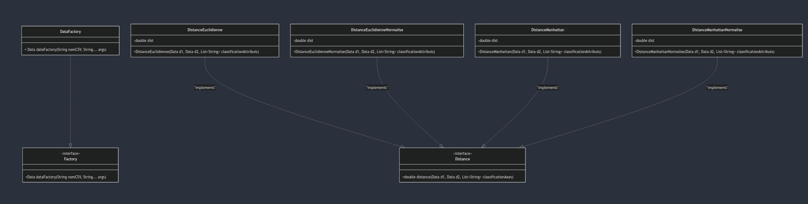
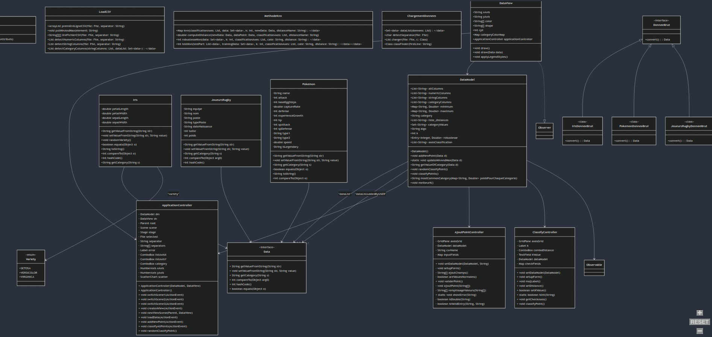

# SAE 3.02

# Membres du groupe G2 :

- Alexandre Legrand
- Aymane Benafquir
- Louis Beck
- Kylian Robin

# Informations :

Pour que le code prenne en charge un nouveau fichier CSV, il est demandé de créer une classe avec les bons attributs implémentant l'interface Data ainsi qu'une classe pour l'importation des données implémentant l'interface DonneeBrut.
De plus, il faut ajouter une ligne à la méthode classFinder de ChargementDonnées et dans la méthode DataFactory de la classe du même nom.

# Jalon 1 :

## Répartition du travail :

__Alexandre Legrand :__

Personnellement, je me suis occupé de la majorité des FXML et de leur fonctionnement (lien entre les méthodes et les champs/boutons). De plus j'ai mis en place le modèle MVC. Aussi, j'ai pu m'occuper de l'ajout des points par l'utilisateur ainsi que la classification de tous les points, du file explorer, des méthodes pour changer de scène et de l'exécution de JavaFX (classe Main). Enfin, j'ai implémenté le fait que l'on puisse ajouter des nouvelles vues depuis l'interface et la javadoc.

__Louis Beck :__

Personnellement, je me suis occupé de la base du chargement du fichier csv afin de récupérer les données, j'ai apporté quelques modifications aux fxml de mes camarades en fonction des méthodes que j'ai créées. J'ai pu m'occuper d'ajouter des nouveaux points(sans les rendre visibles) avec la possibilité de confirmer ou non la saisie de l'utilisateur en cas de données suspectes(valeur négative, nulle ou trop grande) via une comboBox qui permet de facilement gérer le choix de l'utilisateur, gérer la création d'iris et faire le début de la classification des points. Enfin, j'ai pu m'occuper de la création de certain tests.

__Aymane Benafquir :__

Lors de ce premier jalon, je me suis occupé de la conception des fichiers FXML grâce à SceneBuilder en fonction des besoins que l'on avait préalablement identifiés. Aussi, j'ai participé au code qui permet de générer la deuxième page ainsi que le chargement du choix des axes. Je me suis chargé de corriger le modèle MVC lors de la création de la nouvelle vue. 

__Kylian Robin :__
  
Lors de ce premier jalon, je me suis occupé des ajustements sur la conception des fichiers FXML grâce à SceneBuilder. J'ai également implementé l'import du fichier CSV en une classe FormatBrut, des enums variety et de la séparation des données dans des séries distinctes sur le chart.

# Jalon 2 :

## Objectifs :

Pour ce Jalon 2 il va nous rester à implémenter le fait que notre application soit générique et soit compatible avec n'importe quel fichier CSV. Aussi, l'implémentation de l'algorithme Knn. Ensuite, le l'apparition des informations d'un point lorsque l'utilisateur passe dessus avec sa souris. Enfin, il faudra faire quelques tests et du cleancode.

## Répartition du travail :

__Alexandre Legrand__ : 

Pour le second jalon, je me suis occupé de l'affichage des données des points en passant la souris, aussi j'ai pu faire un peu de cleancode. Je me suis occupé également d'une partie de la factorisation pour généraliser notre application à plusieurs fichiers CSV.
Je me suis également occupé de la colorisation et de la forme des points automatiquement. 
De plus, j'ai participé à l'ajout d'un point dynamiquement selon le CSV. J'ai aussi participé à l'implémentation de K-NN ainsi qu'à l'interface de classification d'un point selon cet algorithme. Enfin, j'ai corrigé quelques bugs, fait de la javadoc ainsi que des tests.

__Louis Beck :__

Durant le dernier jalon (le second), j'ai ajouté avec mes camarades l'algorithme k-NN. J'ai également créé les différentes distances (manhattan, euclidienne + normalisées). J'ai réglé quelques bugs d'affichage notamment la catégorie à sélectionner qui s'affichait mal, les pokemons sans type2 modifié en Aucun. De plus, j'ai effectué un peu de clean code, de tests, la modification du choix des categories en récupérant les attributs enumerables. Finalement, j'ai modifié les classes qui touchent aux Pokemons pour faire en sorte d'avoir la catégorie ```ìsLegendary``` à NON CLASSIFIE plutôt que false par défault. 

__Aymane Benafquir :__

Lors de ce second jalon, j'ai intégré les csv pokemon et joueurs de rugby au projet, en créeant les classes et méthodes nécessaires. Aussi, je me suis occupé de la méthode de robustesse de l'algorithme k-NN. 
De plus, j'ai ajouté le pop-up qui permet d'ajouter un point avec les axes chargés dynamiquement en fonction du csv choisi et j'ai en parti corrigé le pop-up de classification des points.
Enfin, j'ai participé à la correction de la classification aléatoire.

__Kylian Robin :__

Pour le second jalon, je me suis occupé de la possibilité de choisir l'algorithme et le nombre de K lors de la classification des points. Egalement, j'ai, avec mes camarades, fait l'implémentation de l'algorithme Knn, ainsi que l'optimisation de cette dernière.

## UML




## Évaluation QDEV
[Jalon 1](https://nextcloud.univ-lille.fr/index.php/s/dtCweoxE2fkrmN2)