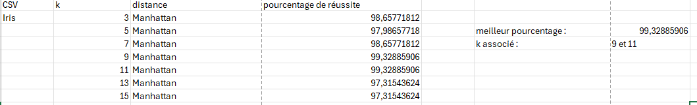
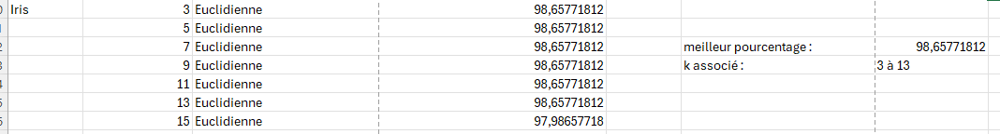
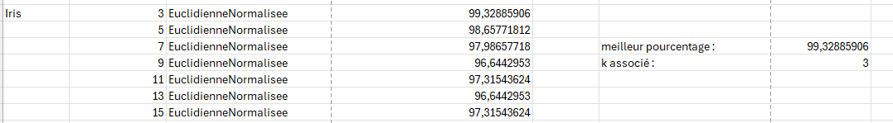
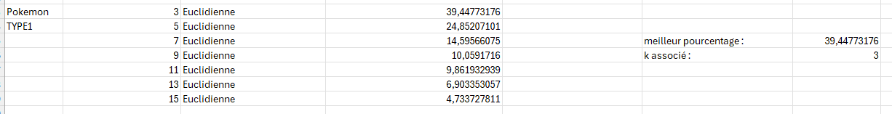
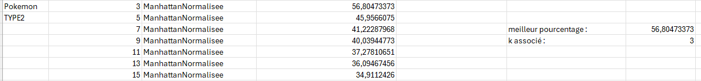
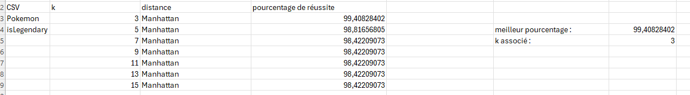
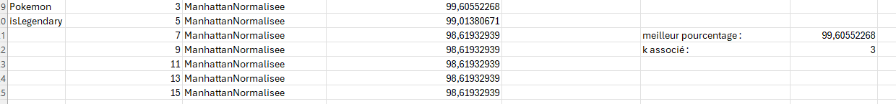

# Rapport de Développement Efficace (SAE 3.02)

## Équipe 
G2

- Alexandre Legrand 
- Aymane Benafquir 
- Louis Beck 
- Kylian Robin

# Classification

## Implémentation du k-NN :

- Nous avons implémenté l'algorithme k-NN dans la classe model/MethodeKnn.java notamment avec la methode knn qui prend en paramètres les attributs permettant la classification, les données de base pour pouvoir calculer la distance, le k choisi, le point à comparer et la distance choisie. Pour cela, nous avons créé une Map qui récupère les données et leur distance. L'utilisation d'une Map nous permet de ne pas avoir à faire des boucles de if qui vérifie chaque distance avec toutes les données.

- Pour le calcul des distances, nous avons créé les classes ```DistanceManhattan```, ```DistanceManhattanNormalisee```, ```DistanceEuclidienne``` et ```DistanceEuclidienneNormalisee``` qui implémentent l'interface Distance. Chaque classe implémente la methode ```distance``` qui calcule la distance entre 2 points avec les calculs adaptés. 

- Pour la normalisation, nous avons simplement créé les classes des distances normalisées qui ont une méthode de calcul permettant de passer les points sur lesquels calculer la distance en paramètres et normalise leurs attributs tout en faisant le calcul de la distance. Pour cela, nous prenons un à un les attributs parmis ceux qui servent à effectuer la classification et nous les normalisons. Puis nous faisons le calcul avec les valeurs normalisées.

- Les méthodes servant à classifier se trouvent dans le controller (```ApplicationController``` pour la classification aléatoire et ```ClassifyController``` pour la classification avec l'algorithme k-NN). Ces méthodes appellent les méthodes présentes dans le ```DataModel```. La méthode ```randomClassifyPoint``` permet de classer un point aléatoirement en récuperant toutes les valeurs possibles pour la catégorie choisie et en sélectionne une au hasard pour l'affecter aux données ajoutées par l'utilisateur. La méthode ```classifyPoint``` permet de classer un point en utilisant l'algorithme k-NN, elle appelle la methode ```knn``` qui permet de récuperer les k plus proches voisins et de classer le point en fonction des catégories de ces voisins. En effet, une fois les k plus proches voisins trouvés nous allons créer une Map avec la catégorie de chaque voisin et son poids(poids calculé en fonction de sa distance, plus il est proche, plus il est élevé). Ensuite, nous allons récuperer la catégorie qui a le plus grand poids et affecter sa catégorie au point à classifier. Nous aurions pu utiliser le pattern strategy plutôt qu'une map afin d'utiliser la classe adaptée.

- Afin d'évaluer la robustesse du k-NN, nous avons utilisé les méthodes ```robustesseKnn``` et ```testKnn```. La méthode ```robustesseKnn``` permet de récuperer (en paramètre) les données de base déjà classifiées, un k, les attributs permettant la classification, la categorie et l'algorithme de distance choisis. Cette méthode va séparer les données en plusieurs jeux de données (nous avons choisi d'en faire 3), va appeler la méthode ```testKnn``` pour chaque jeu de données et va renvoyer le nombre de données bien classifiées. La méthode ```testKnn``` prend en paramètre un des jeu de données (une List) et les autres jeux rassemblés (dans un Set), un k, les attributs permettant la classification, la categorie et l'algorithme de distance choisis. Pour chaque donnée du jeu fournit, elle cherche les voisins grâce à la méthode ```knn``` et vérifie si ils ont ou pas la bonne catégorie. Ensuite elle ajoute 1 au nombre de bonnes classifications si la catégorie est bonne et 0 sinon. Enfin elle renvoie le nombre de bonnes classifications.

## Validation croisée : 

Nous utilisons la méthode ```robustesseKnn``` avec plusieurs k, avec toutes les distances afin d'obtenir des résultats pour chaque distances et k. Ensuite nous récuperons le nombre de points bien classifiés et nous calculons le pourcentage de points bien classifiés. Pour ce faire, nous faisons le calcul suivant : ```nbCorrect* 100 / getDataList().size()```.
- Avec 
    - nbCorrect, le nombre de points bien classifiés
    - getDataList().size(), le nombre de points totaux.

\newpage

## Choix du meilleur k : 

### Iris
- Manattan




- Euclidienne




- Manattan Normalisée


- Euclidienne Normalisée




\newpage

### Pokémon
#### Type 1 :
- Manattan


- Euclidienne




- Manattan Normalisée


- Euclidienne Normalisée


\newpage
#### Type 2 :
- Manattan


- Euclidienne


- Manattan Normalisée




- Euclidienne Normalisée


\newpage
#### isLegendary :
- Manattan




- Euclidienne


- Manattan Normalisée




- Euclidienne Normalisée


\newpage

# Conclusion sur le meilleur choix à faire :

## Pour les Iris,
- le meilleur pourcentage de réussite est de 99,33% avec : 
    - la distance euclidienne normalisée et un k de 3
    - la distance de manhattan normalisée et un k de 3
    - la distance de manhattan et un k de 9 ou 11

## Pour les Pokemon,
### Pour le type 1, 
- le meilleur pourcentage de réussite est de 39,64% avec : 
    - la distance de manhattan et un k de 3

### Pour le type 2, 
- le meilleur pourcentage de réussite est de 57,99% avec : 
    - la distance de manhattan et un k de 3

### Pour isLegendary, 
- le meilleur pourcentage de réussite est de 99,61% avec : 
    - la distance de manhattan normalisée et un k de 3
    - la distance de euclidienne et un k de 3

### Conclusion :
Le k le plus efficace semble être k=3. Pour la distance, cela varie en fonction de la catégorie. La distance de manhattan semble plus efficace sur des catégories assez vastes (type 1 et 2 ) et la distance de manhattan normalisée semble être plus efficace sur des catégories peu vastes (isLegendary pour Pokemon et variety pour Iris).